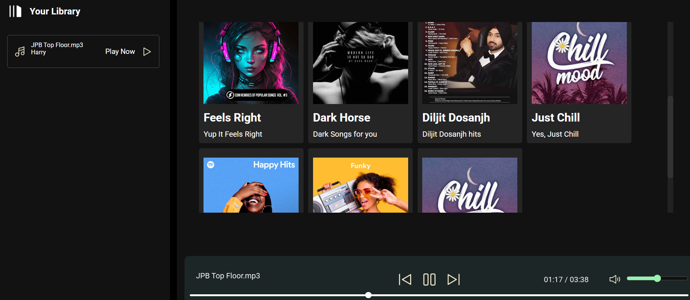

# Spotify Clone 🎵

[](https://lowkeygud.github.io/spotify-clone/)

Welcome to **Spotify Clone** — a modern, interactive web music player inspired by Spotify. Play, browse, and enjoy playlists with a beautiful UI, smooth controls, and responsive design.

---

## 🚀 Features

- 🎧 **Playlists & Albums**: Browse curated albums and moods.
- 🖼️ **Album Covers**: Each album features unique cover art.
- ⏯️ **Play, Pause, Next, Previous**: Full music controls.
- 🔊 **Volume & Mute**: Adjust volume or mute instantly.
- 📱 **Responsive Design**: Works on desktop and mobile.
- 🕹️ **Interactive UI**: Hamburger menu, seekbar, and more.
- ⚡ **Fast & Static**: Powered by GitHub Pages, no backend required.

---

## 🌐 Live Demo

👉 **[Try it now!](https://lowkeygud.github.io/spotify-clone/)**

---

## 📝 How It Works

- All albums and songs are listed in [`songs.json`](./songs.json).
- Music and covers are stored in the `songs/` folder.
- No server required — everything is static and fast!

---

## 📦 Project Structure

```
spotify-clone/
├── css/
│   ├── style.css
│   └── utility.css
├── img/
│   └── ...svg/png assets
├── js/
│   └── script.js
├── songs/
│   └── [album folders]/
│       ├── cover.jpg
│       ├── info.json
│       └── [song files].mp3
├── songs.json
├── index.html
└── README.md
```

---

## 🎶 Adding/Updating Songs

- Most songs are currently the same, but new tracks and albums will be added over time.
- To add your own, update `songs.json` and place your `.mp3` files in the correct album folder.

---

## 💡 Tech Stack

- HTML, CSS, JavaScript
- Static hosting via GitHub Pages

---

## ✨ Contributing & Feedback

Pull requests and feedback are welcome! Feel free to fork, star, or suggest new features.

---

## 📱 Screenshots



---

## © 2025 LowkeyGud

Enjoy the music!
